## time: 29 hours

## july 6 & 7

got inpsiration for this project from this reel: https://www.instagram.com/p/DKDFd3nS-c8/
other inspiration: https://circuitdigest.com/microcontroller-projects/DIY-wifi-controlled-drone

goals of this drone:

- can fly reliably
- wireless controller
- PID control
- 4 ish minute flight time
- usb c charging
- can have semi reliable autonomous paths (can create one to takeoff, fly from my room to couch, and land, reliably)

the guy uses NewBeeDrone BDR GOLD Edition - 6mm Brushed Motor, so i'll be basing my design off of these motors

shoutout to this blog article for being quite helpful in esp selection: https://eitherway.io/posts/esp32-buyers-guide/
i will go with the esp32-c3-wroom-02 for its bluetooth 5.0 and efficiency

parts v1:
NewBeeDrone BDR GOLD Edition - 6mm Brushed Motor (https://newbeedrone.com/products/newbeedrone-bdr-gold-edition-6mm-brushed-motor)
Bitcraze Crazyflie Nano Quadcopter Replacement Propellers (https://ca.robotshop.com/products/crazyflie-nano-quadcopter-replacement-propellers)
Fytoo 5pcs 3.7V 500mAh 25C Li Battery (https://www.amazon.ca/dp/B0794ZPVSX)
ESP32-C3 (https://www.digikey.ca/en/products/detail/espressif-systems/ESP32-C3/14115579)
GY-87 (https://x2robotics.ca/gy-87-10dof-mpu6050-hmc5883l-bmp180-sensor-module)
TYPE-C-31-M-12 (https://lcsc.com/product-detail/USB-Type-C_Korean-Hroparts-Elec-TYPE-C-31-M-12_C165948.html)
TP4056 (https://www.aliexpress.com/item/1005005838857868.html)
SPX3819M5-L-3-3 (https://www.aliexpress.com/item/1005007348027539.html)
IRLZ44N (https://www.aliexpress.com/item/1005006228628494.html)

- figure out how to implement tp4056 with battery protection or figure out if its not necessary
- figure out how to add breakout board to custom pcb

components left: motor driver, battery charge terminal, controller components (oled screen etc)

+4 hours; lot of research :( 

making a choice not to use usb uart bc im using esp32 c3 and will just use the native usb support

# schematics:

## july 8th

components:
usb_c_receptable_usb2.0_16p
AO3401A
SS34
SPX3819M5-L-3-3
4 capacitors, 3 resistors, and 1 led

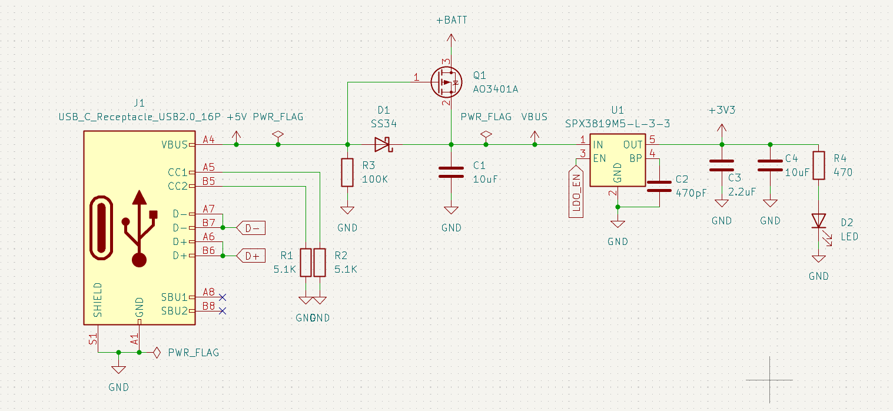

circuit explanation for later me:
- cc1 and cc2 have resistors to let chargers know to supply power, not take in power
- vbus is 5v, the goal of the circuit is to convert it into stable 3v
- power goes to ss34 where cathode is toward vbus, prevents reverse current
- r3 ensures mosfet is on when usb isnt connected due to gnd connection, and turns mosfet off when usb is connected
- ao3401A (mosfet) allows for battery power when usb isnt connected
- EN is to turn the ldo on, which acts as the power switch for the entire device
- BP is for noise reduction, adding a capacitor does this
- two more capaicitors to add stabalization on the 3v3 rail, connected in parallel and will supply voltage in drops
- green led for on status

components:
TP4056
2 resistor, 3 resistor, 1 capacitor
51005-0200 molex female housing

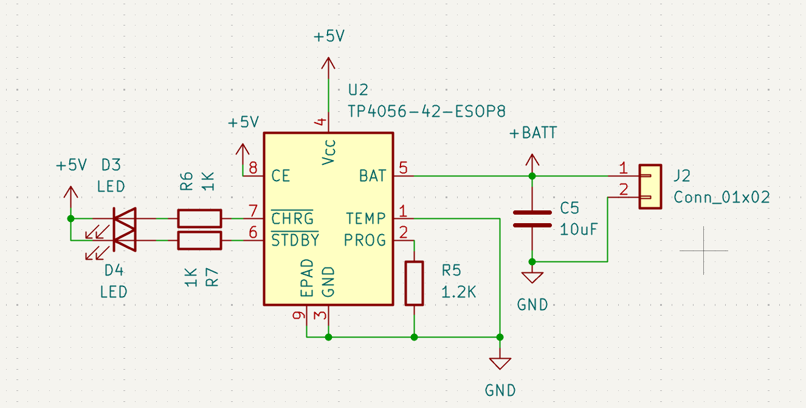

circuit explanation: 
- power comes from vcc
- ce turns on charging, connected to 5v so always charging
- epad is for cooling
- temp is for temp monitoring (not doing that)
- prog is to set charging amps (1amp at 1.2k resistor)
- capicitor smooths out charging

third schematic: on/off and voltage monitoring (battery control)

components:
3 resistors
MST22D18G2_125 (https://www.amazon.ca/100Pcs-MSS22D18-Miniature-Switch-Handle/dp/B093LBLK6D)

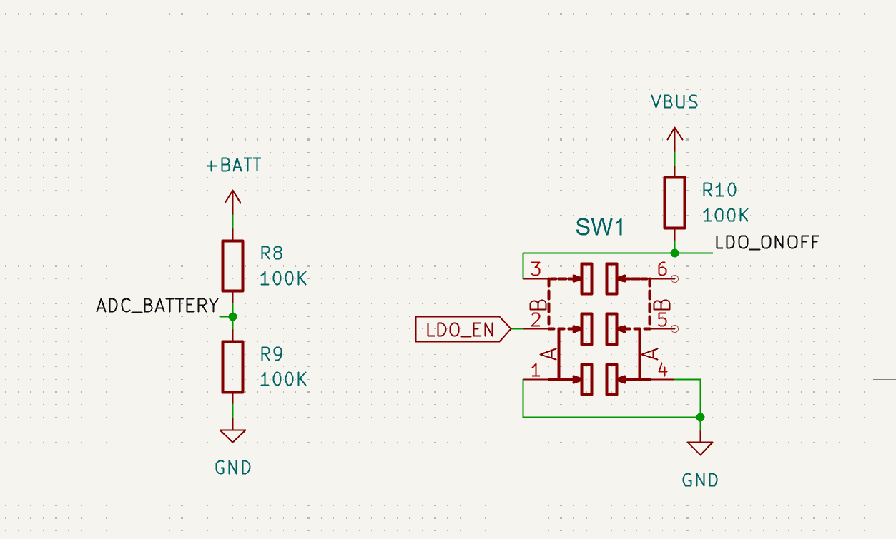

+6 hours

## july 9th

circuit explanation:
- battery capacity is measured by the voltage divider, linking to an adc pin
- when switch is toggled, it either connects ldo's en to gnd (off), or to vbus via r10
- r10 is there to not short the circuit when untoggled (pull up resistor)

fourth schematic: microcontroller

components: 
- esp32-c3-wroom-02
- 2 resistor, 1 capacitor

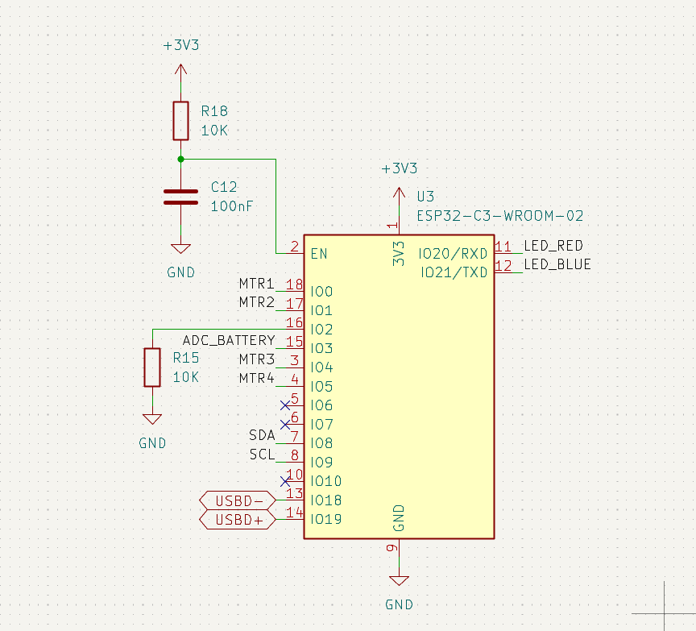

circuit explanation:
- en must be HIGH to boot, pull up resistor and capacitor for stability
- io2 is for boot and optionally has a pull down resistor
- io6, 7, and 10 are for firmware and cannot be connected
- io20/21 are rxd and txd and supposed to be for uart serial communication, but since im using native usb ill be controlling leds with them
- io3 works for adc
- io18/19 are usb for the esp32-c3-wroom-02

fifth schematic: sensor
unfortunately the mpu6050 seems to only be in qfn form (and discontinued) and since i dont have the tools to solder that, i'll be using the gy-87 module
links that are helpful w this:
https://docs.sunfounder.com/projects/elite-explorer-kit/en/latest/basic_projects/09_basic_gy87.html
https://www.reddit.com/r/PrintedCircuitBoard/comments/b704j7/how_to_connect_breakout_board_with_a_pcb/
https://electropeak.com/learn/interfacing-gy-87-10dof-imu-mpu6050-hmc5883l-bmp085-module-with-arduino/
https://5.imimg.com/data5/LF/FE/MY-1833510/gy-87-10dof-mpu6050-hmc5883l-bmp180-sensor-module.pdf

gy87 symbol: 
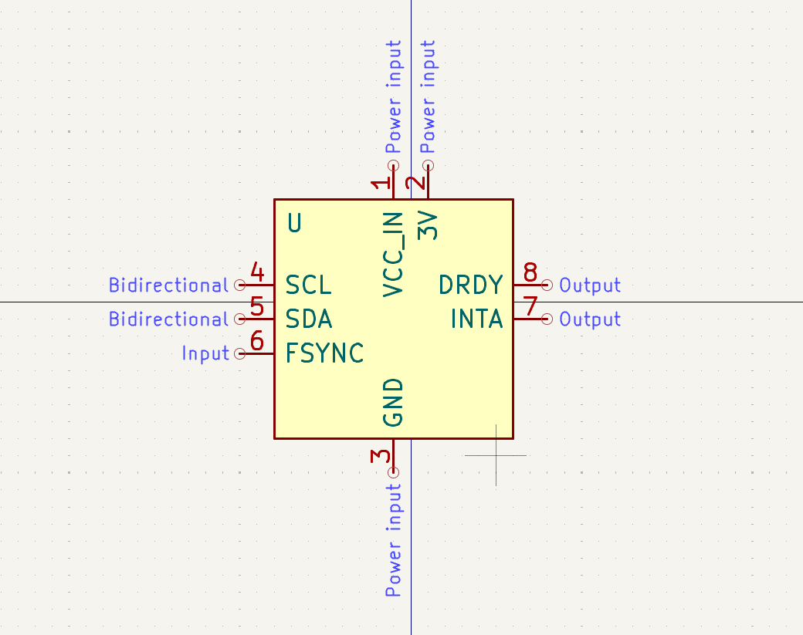

components:
- gy87
- 2 capacitor

connections:
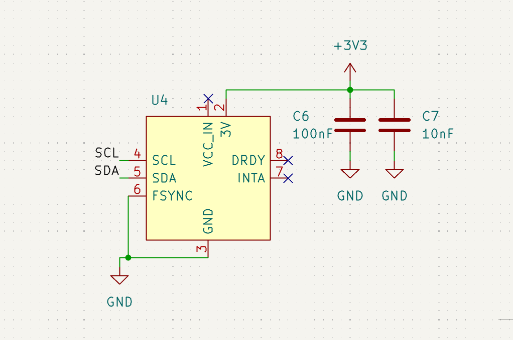

circuit explanation:
- scl and sda go to the pins on esp32, dont need pull up resistors or 3v because the breakout board already has that
- dont use vcc_in, drdy, and inta
- fsync connects to gnd because its an output pin unlike the other input pins, and so may pick up on random noise and so has to be connected to gnd
- breakout board likely already has decoupling capacitors for the power, but might as well add them anyways for ensured reliability

+6 hours

## july 10th

sixth schematic: motor drivers

components:
- 4 IRLML6344TRPBF
- 4 resistor
- 4 1N414BW

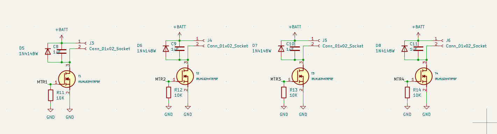

circuit explanation:
- pin 1 is the gate on the mosfet, pin 3 is the drain, pin 2 is the source
- when pin 1 of the mosfet is turned on by the microcontroller, the switch is on and the current can flow from the battery to gnd
- this allows the motor to spin because it connects the motors negative terminal to gnd
- when the mosfet is closed, the motor cannot spin because it only has positive terminal plugged into the battery

seventh schematic: status leds

components:
- 2 leds
- 2 resistors

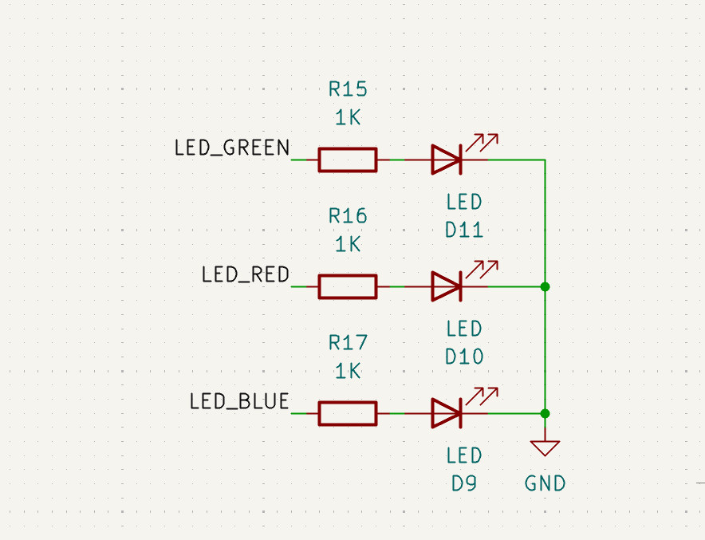

finished
now for errors :(
fixed errors, apparently net labels dont work across sheets so made it all hierarchical lables

finished root schematic
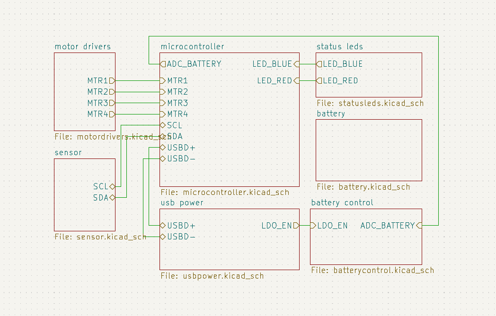

footprint notes:
using 603 standard footprints for mostly everything

GY-87 footprint
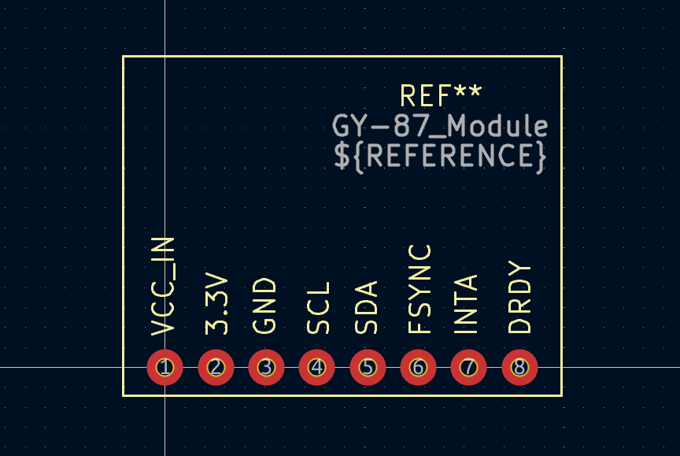

swapped out the original switch with a different one bc the other one is impossible to source
ss12-d00 footprint: (also made the schematic)
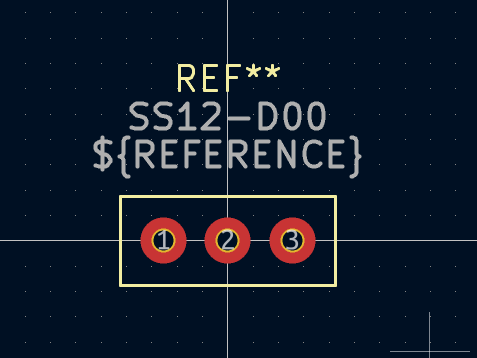

irlml6344TRPBF footprint
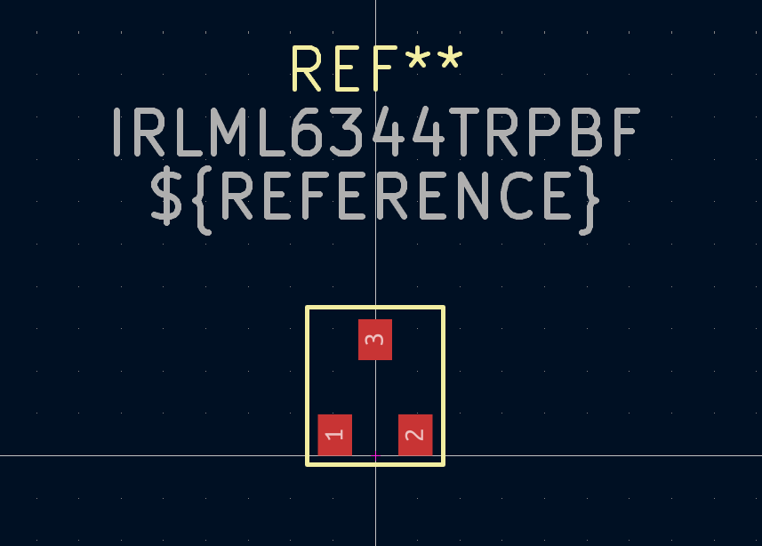
requirement: leave >= .2mm clearance between silkscreen and pads

zero errors/warnings in erc and updating pcb from schematic !!

+4 hours

# bom making:
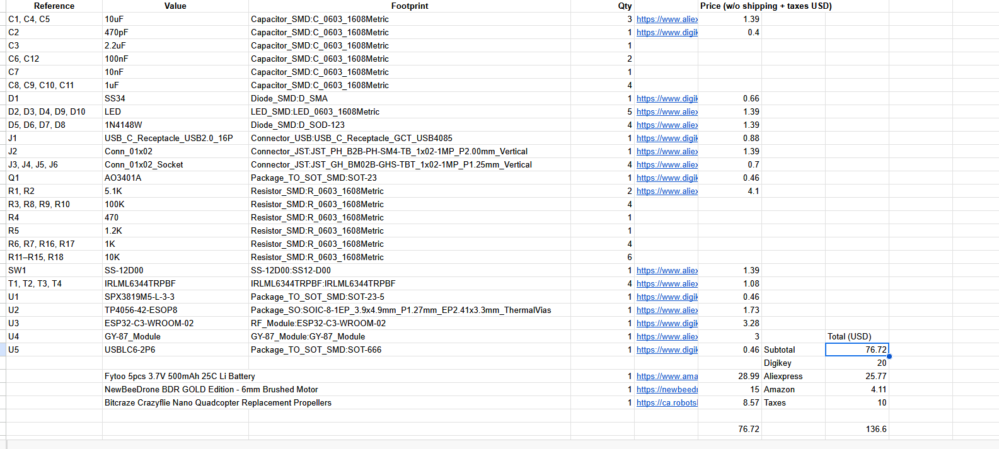

+1 hour

# pcb

rough positioning: 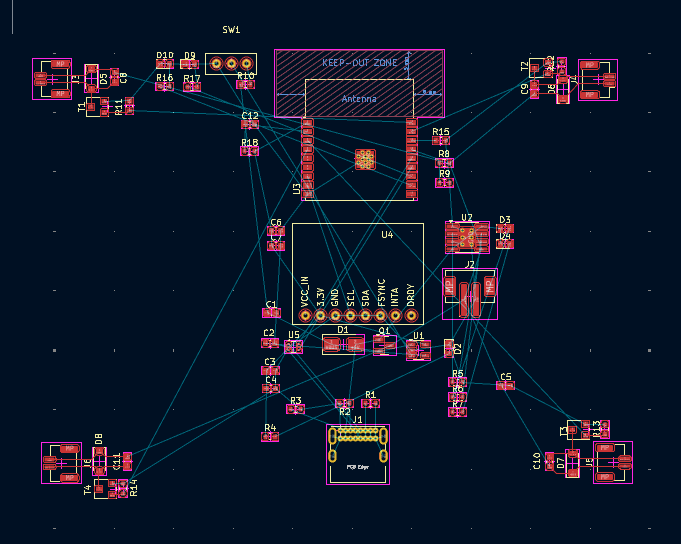

doing a 2 layer pwr + signal / gnd pcb
this is because 4 layer is complicated and probably unnecessary

progress:
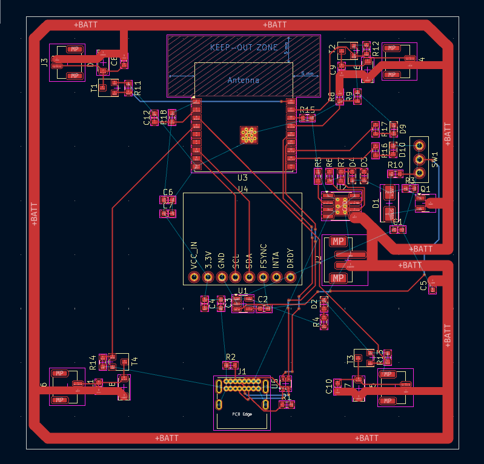

note: vbus is the unprotected power rail directly from usb, while 5v is the protected one
this doesnt make sense with my current schematic cause then the vbus isnt really doing anything, its just connected to the diode
the 5v from the usb is the one powering everything anyways
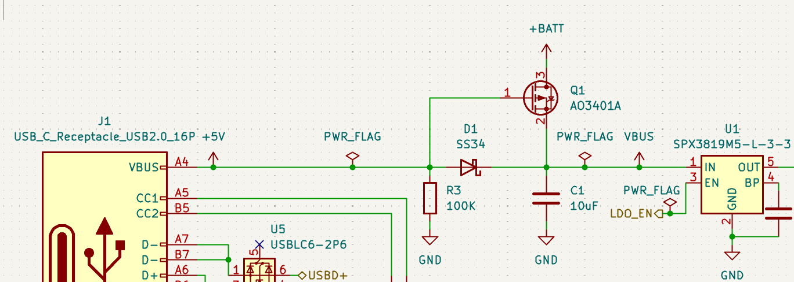
so swapping the 5v and vbus flags in the schematic above to correctly reflect the unprotected 5v from the usb going to the diode, becoming protected

+3 hours

## july 15th - 17th

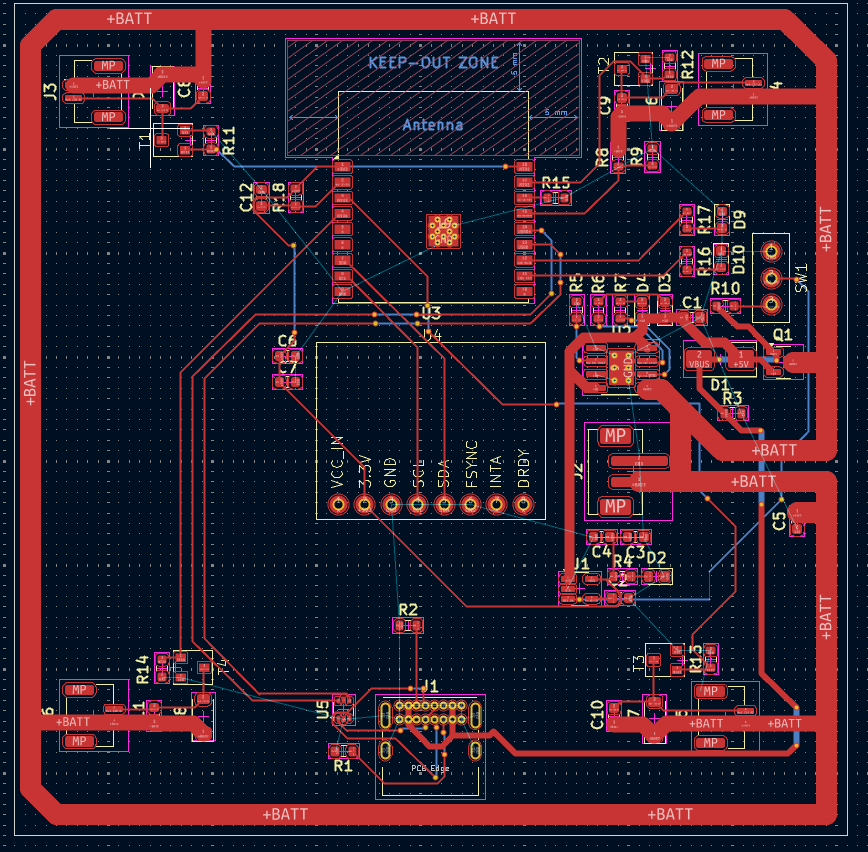
done with everything except ground layer

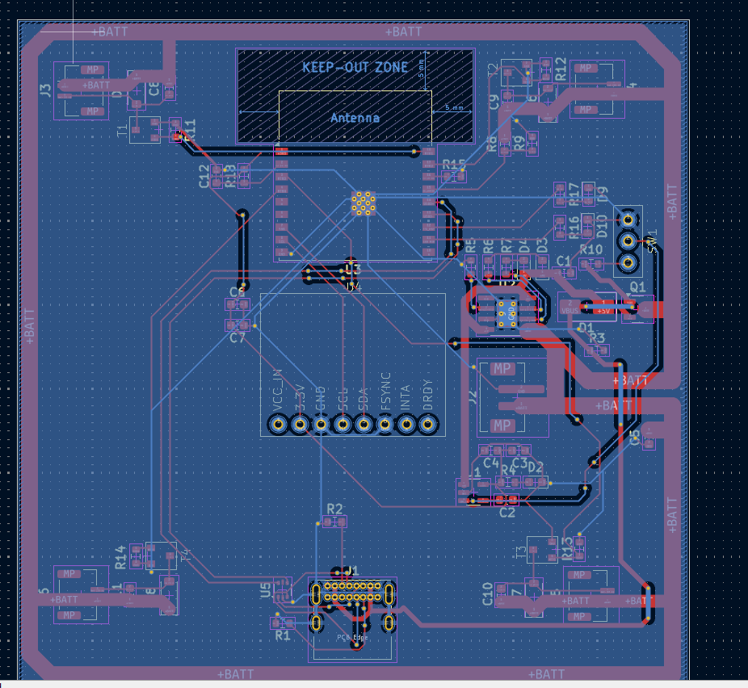
with gnd layer

box:
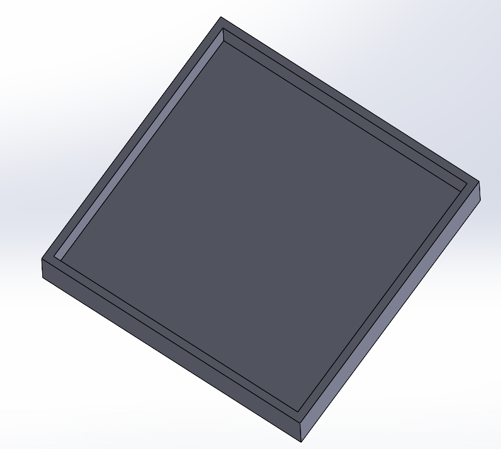

+2 hours

## july 18th

slight pivot, i was going to cad a 3d printed case for this but realized that the motors are actually not that powerful, and a 3d printed case might be too heavy
theres also no reason to have a case if i can just use the pcb, its seemingly stable enough
the only issue would be vibrations potentially affecting the hardware, but since this doesnt seem to be a huge problem in the litewing, it should be fine for my project
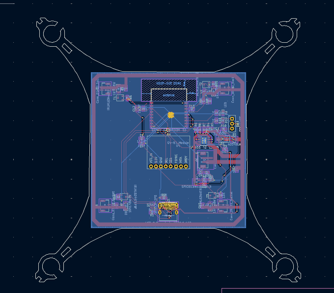

+1 hour

# firmware

using micropython as circuit python is apparently bad for pwm, i dont want to use arduino c, and no one uses espressif's thing probably

mpu6050 driver: https://github.com/nickcoutsos/MPU-6050-Python
(also requires smbus package, replaced that with smbus3)

really basic firmware code, cant really do more without the microcontroller

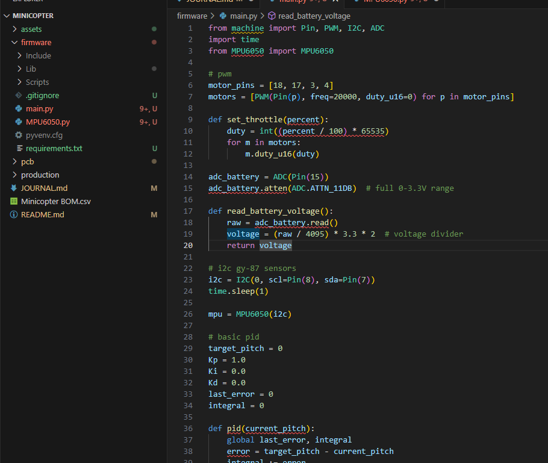

+2 hours

generating production files
