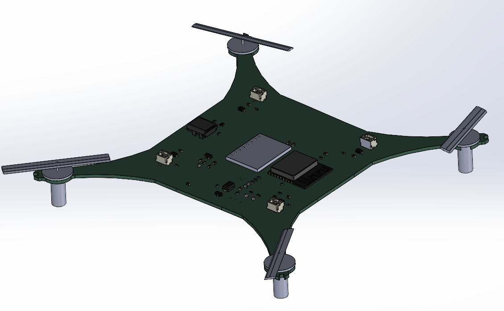
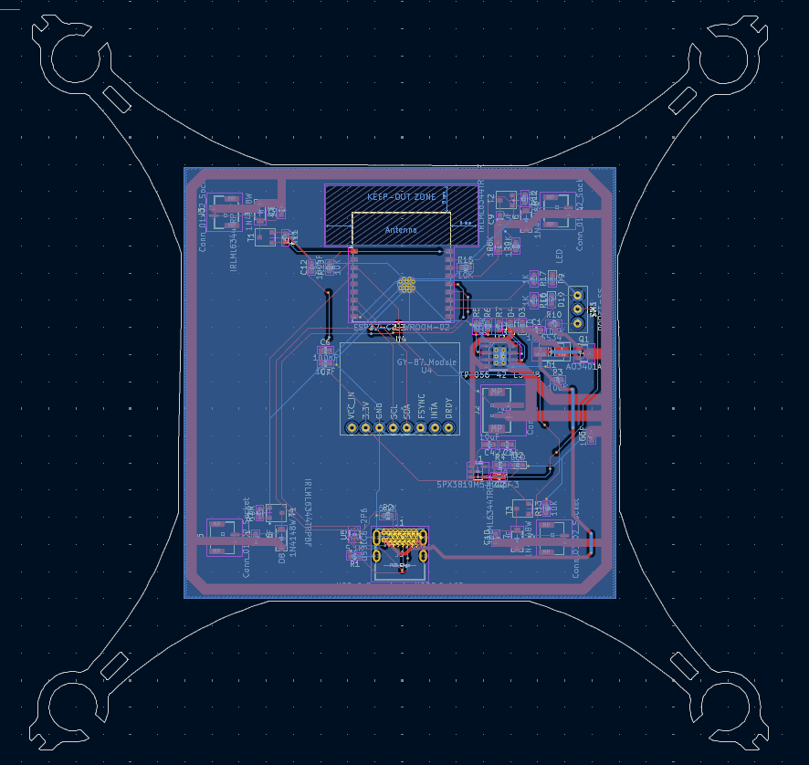

# Minicopter

A lightweight ESP-32 based drone capable of autonomous pathing, built for agility. Uses the GY-87 breakout board with a three-axis gyroscope + triaxial accelerometer + three-axis magnetic field + pressure. Charges a LiPo battery with USB-C and can be flashed with firmware.
Can be controlled with both pathing commands and bluetooth controls.

I made this project after getting inspiration from a different esp32 drone reel, and thought I could make that too
I've additionally always wanted to get into creating a from-scratch hardware project that includes microcontrollers and pcbs, and thought this was the perfect place to start

## Read the [JOURNAL.md](JOURNAL.md)

# BOM

| Value                               | Qty | Price (USD, approx) |
|-------------------------------------|-----|-------------|
| 10uF                                | 3   | 0.46        |
| 470pF                               | 1   | 0.4        |
| 2.2uF                               | 1   |    0.19         |
| 100nF                               | 2   |        0.14     |
| 10nF                                | 1   |         0.09    |
| 1uF                                 | 4   |          0.05   |
| SS34                                | 1   | 0.66        |
| LED                                 | 5   | 1.39        |
| 1N4148W                             | 4   | 0.77        |
| USB_C_Receptacle_USB2.0_16P         | 1   | 0.88        |
| Conn_01x02                          | 1   | 1.39        |
| Conn_01x02_Socket                   | 4   | 0.70        |
| AO3401A                             | 1   | 0.46        |
| 5.1K                                | 2   | 0.45        |
| 100K                                | 4   |     0.2        |
| 470                                 | 1   |       0.28      |
| 1.2K                                | 1   |          0.61   |
| 1K                                  | 4   |          0.2   |
| 10K                                 | 6   |            0.19 |
| SS-12D00                            | 1   | 1.39        |
| IRLML6344TRPBF                      | 4   | 1.08        |
| SPX3819M5-L-3-3                     | 1   | 0.46        |
| TP4056-42-ESOP8                     | 1   | 1.73        |
| ESP32-C3-WROOM-02                   | 1   | 3.28        |
| GY-87_Module                        | 1   | 3.00        |
| USBLC6-2P6                          | 1   | 0.46        |
| 3.7V 500mAh 902530 25C LiPo Battery | 3   | 12.68       |
| NewBeeDrone BDR Unicorn Edition Motors - 6mm Brushed Motors    | 1   | 19.99       |
| NewBeeDrone Venom V2 Super Durable Propellers     | 1   | 2.99        |
| Total (w/ shipping + tax)           |     | 138.15      |